```{r setup, include=FALSE}
knitr::opts_chunk$set(echo = TRUE)
```


```{r , echo=FALSE, warning=FALSE, message = FALSE}
library(plotly)
library(tidyverse)
library(ggplot2)
library(pals)
library(RColorBrewer)
pacman::p_load(tidyverse, pacman, ggmap, janitor, sf, mapview, leaflet, rgdal, RColorBrewer,lubridate, boot, broom)
```

```{r , echo=FALSE, warning=FALSE, message = FALSE}
load("data_ready.RData")
```

# Introduction and description of database

According to the Swiss Federal Statistical Office, the population of Switzerland has grown from 7,955 millions in 2011 to 8,670 millions in 2020. This number continues to grow as well as the number of foreign citizens living in Switzerland. At some point, some of those foreigners acquire the Swiss citizenship and integrate the Swiss society. In this report we explore the dataset containing information about the people who as foreign nationals obtained a Swiss passport.
The aim of this report is to analyze how the naturalization in Switzerland evolved in the last years and to understand the profile of the people that seek to obtain a Swiss nationality. Since, there is many attributes that we should take into account, we thoroughly analyze the characteristics of such people, as well as the way they obtained the Swiss nationality.

The following analysis is performed using the data that is provided by the Swiss Federal Statistical Office (referred as FSO later in the report), which is the national competence center for official statistics in Switzerland. The analysis is performed on the data generated between 2011 and 2020.

We are particularly interested in this interval of time because in June 2014, the Swiss Parliament updated the Federal Act on Swiss Citizenship (RS 141.0) and passed a law that restricts heavily the process of naturalization and adds new conditions to it. The law entered in force in January 2018. One of the motivations of this report is to verify and inspect the effects of this law on the number of naturalization.

For this report, we are using 2 complementary dataset: the annual population of Switzerland by cantons and the geographical characteristics of the cantons. Both of the dataset are provided by the FSO. The main dataset that is used for the report is composed of the following variables:

- `Previous.citizenship`: categorical variable stating the previous citizenship of the individual;

- `Age`: the numeric variable stating the age of the individual (between 0 and 100 years);

- `Genre`: categorical variable representing the gender of the individual (Male or Female);

- `Type.of.acquisition`: categorical variable stating the type of acquisition with the following 5 levels:

  - `Confirmation of the Swiss nationality`: individual claims to be a Swiss citizen and has to prove it to the authorities;
  
  - `Naturalisation by adoption`: individual is adopted by a Swiss citizen;
  
  - `Ordinary naturalisation`: standard way to acquire Swiss citizenship;
  
  - `Reintegration`: individual had Swiss citizenship but lost it in the past;
  
  - `Simplified naturalisation`: for special cases, e.g., wife or husband of a Swiss citizen, child of a Swiss citizen, etc.
  
- `Canton`: categorical variable with 26 factor levels stating the canton where the Swiss citizenship is acquired;

- `Year`: time variable which represents the year of acquisition of Swiss citizenship (from 2011 to 2020); and,

- `Value`: the total number of Swiss nationality acquisitions depending on all the previous criteria.

# General overview of data

## Counts by Canton

First, to form an idea about our research question, let's have a look on how the number of naturalization is distributed across Switzerland. The easiest way to do that in terms of visualization, is to plot our data as a geographic map of Switzerland and draw borders between cantons. The map represents the total number of people who acquired a Swiss citizenship between 2011 and 2020 within each canton. The magnitude is represented by the darkness of the blue color: the darker the filling of the canton is - the more people obtained a Swiss passport in that canton. 

```{r echo=FALSE, out.width='80%', fig.align='center'}
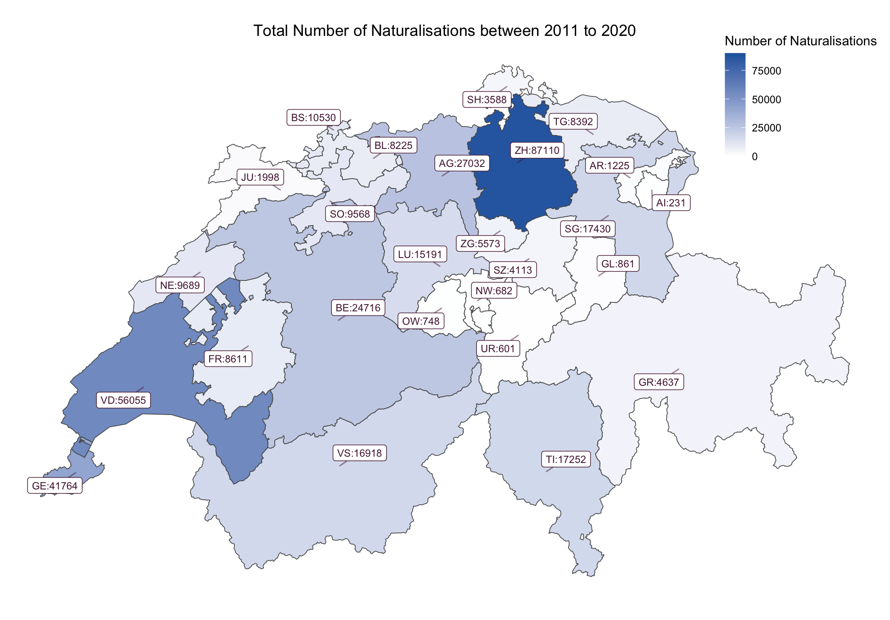
```

Over the 9 years, the cantons with the highest numbers of naturalization are: Zurich, Vaud and Geneva. These findings make sense as each of these 3 cantons contain big cities in terms of population: Zurich, Lausanne and Geneva. These cities, in fact, hold a big concentration of foreign citizens since many international organizations, headquarters of multinational companies and universities are based in them.

We can visualize the same map as a gif which changes the filling of cantons depending on the year.

```{r echo=FALSE, out.width='80%', fig.align='center'}
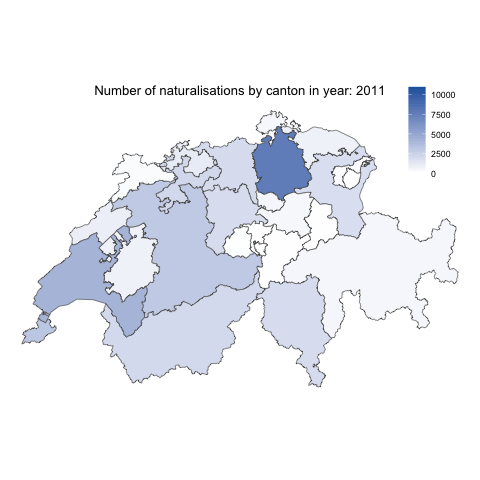
```

We notice that through years, cantons of Switzerland with the most naturalization are Zurich, Geneva and Vaud. We also notice that through years, the difference in numbers between cantons tends to change. 

## Over time

```{r , echo=FALSE, warning=FALSE, message = FALSE, out.width='60%'}
total_by_year <- data_ready %>%
  group_by(year) %>%
  summarise(total = sum(total))
```

```{r, echo=FALSE, warning=FALSE, message = FALSE}
total_by_year <- total_by_year %>%
  rename(Year = year,
         Total = total)
```


```{r, echo=FALSE, warning=FALSE, message = FALSE}
data_ready <- data_ready %>%
  rename(Year = year,
         Total = total,
         Canton = canton,
         Relative = relative)
```

To inspect the difference of numbers of naturalization through time, we propose to plot a time series plot which represents the total number of naturalization in Switzerland between 2011 and 2020.

<center>
```{r , echo=FALSE, warning=FALSE, message = FALSE, out.width='50%', out.height='50%'}
p <- ggplot(total_by_year, aes(x = Year, y = Total)) + geom_line() +
  geom_point() +
  scale_x_continuous(breaks=seq(2011, 2020, 1)) +
  ylim(0,50000) +
  theme_bw() +
  labs(title = "Total number of naturalisations over time",
       x = "Year",
       y = "") +
  theme(plot.title = element_text(hjust = 0.5, size = 10))

ggplotly(p)
```
</center>

Before 2014, the number of naturalization tend to be more or less constant (34'102 on average naturalization each year). From 2014 to 2017, the number of new citizens increased every year until it reached 44'949 in 2017. After, 2017 the number of naturalization decreased until 34'141 in 2020 (close to the numbers of naturalization before the increase in 2014).

In the plot, the black dots represent the number of naturalization for each of the 26 cantons by year. The blue smooth line represents the conditional mean of the number of naturalization given the year.

<center>
```{r , echo=FALSE, warning=FALSE, message = FALSE, out.width='50%', out.height='50%'}
p <- ggplot(data_ready, aes(x = Year, y = Total)) +
  geom_point() +
  geom_smooth() +
  scale_x_continuous(breaks=seq(2011, 2020, 1)) +
  ylim(0,11000) + 
  theme_bw() + 
  labs(title = "Total number of naturalisations over time",
       x = "Year",
       y = "") +
  theme(plot.title = element_text(hjust = 0.5, size = 10))
ggplotly(p)
```
</center>

We notice that an important share of the points is situated below 3000 and every year has 2 - 4 outliers. Over the years, the conditional mean seems to slightly increase until 2017 and decrease after.

We explore in this plot the distribution of number of naturalization for each year.

<center>
```{r , echo=FALSE, warning=FALSE, message = FALSE, out.width='50%', out.height='50%'}
p <- ggplot(data_ready, aes(x=as.factor(Year), y=Total)) +
  geom_boxplot() + 
  labs(title = "Total number of naturalisations over time",
       x = "Year",
       y = "") +
  theme_bw() +
  theme(plot.title = element_text(hjust = 0.5, size = 10)) 
ggplotly(p)
```
</center>

It seems that the boxes doesn't change a lot over the years, but we notice that the number of outliers increases through time.

## Relatively by Canton

Comparing cantons between themselves without accounting for their difference in populations may lead to wrong conclusions. Here, we plot the map of Switzerland and devide the total number of naturalization in a canton by the population of the said canton. We then multiply this number by 100. The obtained number represents the share of the new Swiss citizens to the total population for each canton. This manipulation allows us to see the relative difference in the numbers of naturalization between cantons.

```{r echo=FALSE, out.width='80%', fig.align='center'}
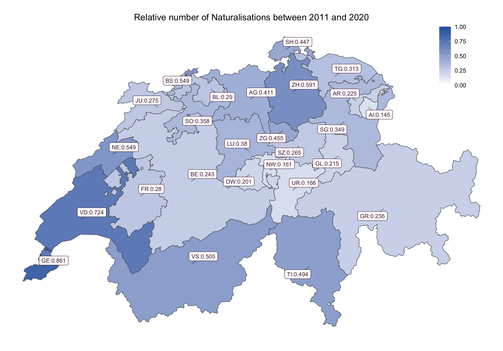
```

We notice that the cantons with the highest rates are still Geneva, Vaud and Zurich, but the order changes. Also, we notice that cantons of Valais and Ticino have also high rates. Overall, we notice that the difference, in terms of magnitude, seems to be much lower than before (when we didn't account for the population).

The gif representing the change by years of the naturalization's rate for each canton, shows that the difference in rates seems to change over year and to be higher from 2015 to 2017 compared to other years.

```{r echo=FALSE, out.width='80%', fig.align='center'}
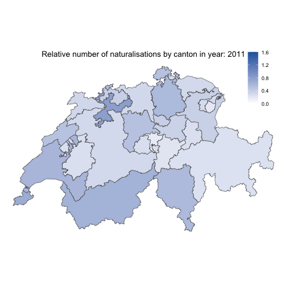
```

## Over time by Canton

We can inspect the change through time of the the number of naturalization by canton by plotting a stacked time series plot where each leayer represents a canton.

<center>
```{r, echo=FALSE, out.width='70%', out.height='70%'}
p <- ggplot(data_ready, aes(x = Year, y = Total, fill = Canton)) +
  geom_area(color = "black") +
  labs(title = "Total number of naturalisations by canton over time",
       subtitle = "2011 - 2020",
       x = "Year",
       y = "",
       fill = "Canton") +
  scale_x_continuous(breaks=seq(2011, 2020, 1)) +
  theme_minimal() +
  theme(axis.text.x=element_text(angle=45, hjust=1)) +
  theme(plot.title = element_text(hjust = 0.5))
ggplotly(p)
```
</center>

As mentioned previously, the highest numbers of naturalization tend to have cantons of Zurich, Vaud and Geneva. Overall, we notice the same pattern we discussed before: the total number of naturalization is constant before 2014, increases until 2017 and decreases after. 
However, through time, the share of almost each canton is maintained and the increase in total number of naturalization is generated particularly by 2 cantons: Vaud and Geneva. These 2 cantons had a much stronger increase in 2014 than other cantons. Between 2014 and 2016 the number of naturalization more than tripled in Geneva and in Vaud almost doubled.

<center>
```{r, echo=FALSE, out.width='70%', out.height='70%'}
p <- ggplot(data_ready, aes(x = Year, y = Relative, fill = Canton)) +
  geom_area(color = "black") +
  labs(title = "Relative number of naturalisations by Canton over time",
       subtitle = "2011 - 2020",
       x = "Year",
       y = "",
       fill = "Canton") +
  scale_x_continuous(breaks=seq(2011, 2020, 1)) +
  theme_minimal() +
  theme(axis.text.x=element_text(angle=45, hjust=1)) +
  theme(plot.title = element_text(hjust = 0.5))
ggplotly(p)
```
</center>

By inspecting the relative number over time for each canton, we notice that the shares of cantons are not as different as we didn't account for the total population by canton. As the population increases, the number of naturalization increases and the difference in years seems to be smaller in relative numbers. However, we still notice that the share of Geneva and Vaud seems to increase a lot after 2014.


## Investigating the type of acquisition

```{r echo=FALSE, out.width='60%', fig.align='center'}
knitr::include_graphics('plots/thomas/chart_acquisition.png')
```

Looking at this chart, we see that there is two main type of acquisition (ordinary one and simplified one) for a total of 99.38%.
As defined in the introduction, there is three type of acquisition that are considered as special cases (`Confirmation of the Swiss nationality`, `Naturalisation by adoption` and `Reintegration`).

### By age and gender

The plot explores the composition of the total number of naturalization between 2011 and 2020 by gender and the age group. Within each group, we visualize the type of the naturalization that was obtained.

```{r echo=FALSE, out.width='70%', fig.align='center'}
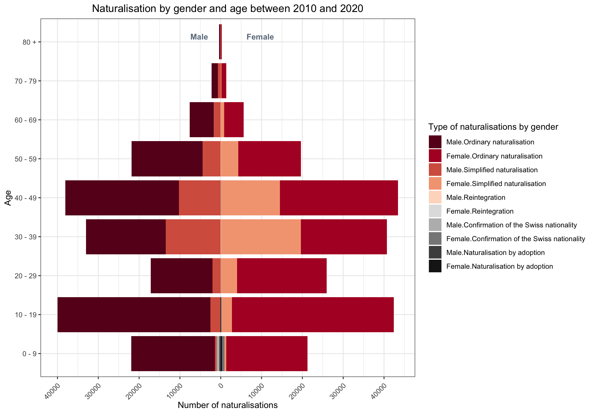
```

We notice that the age groups which tend to have the highest numbers of naturalization belong to the groups of 10-19, 30-39 and 40-49.
We may assume, that these age categories correspond to working professionals and their children.
Also, we notice that for age groups of 30-39 and 40-49 the shares of ordinary and simplified naturalization are very close, for other groups, the ordinary naturalization seems to be much more higher.
Also, the simplified naturalization tend to be slightly higher for females belonging to the age groups 30-39 and 40-49 than for males of the same age groups. Another interesting finding, is that the 3 least popular types of naturalization: specifically, naturalization by adoption, naturalization by confirmation of the Swiss nationality and Reintegration, are nonexistant for most of the age groups. Naturalization by adoption and naturalization by confirmation of the Swiss nationality are only present for age groups of 0-9 and 10-19. The share of naturalization by integration seems to be very small for all the age groups.

The gif represents the change of the composition over the years of the number of naturalization by gender and the age groups.

```{r echo=FALSE, out.width='60%', fig.align='center'}
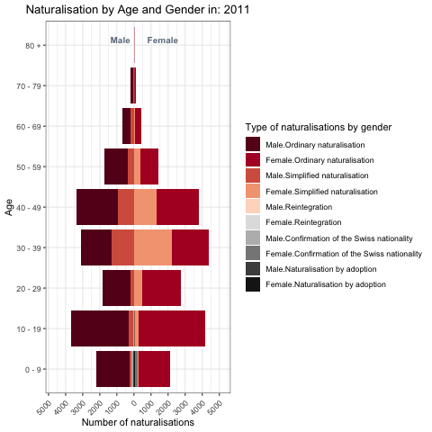
```

We notice, as stated previously, that there seems to been overall increase before 2017 followed by a decrease. The composition seems to stay similar over the years, but minor changes happen within the groups.

The rest of the report concentrates more thoroughly on different groups depending on the type of naturalization.

# Basic exploration of three less represented types of acquisiton

Let's take a look at the following type of acquisition : `Confirmation of the Swiss nationality`, `Naturalization by adoption` and `Reintegration`. Since each type of acquisition is quite different, we will take a look at them one by one.

## Confirmation of the Swiss nationality

First, note that there has been only `1452` confirmation between 2011 and 2020 which lead to a mean of `145.2` per year. We first plot the total number of such citizens for the 50 citizenship with the higher values and then look at all by age and gender.

```{r echo=FALSE, out.width='50%', fig.align='center'}
knitr::include_graphics('plots/thomas/confirmation_previous_citizenship.png')
```

We can see that in the top 10, except for Brazil, there is only European countries, in particular the three first are bordering ones. This may be due to the fact that most of expatriation of Swiss citizen is in European countries, particularly in western Europe (Germany, France, Italy, Spain).

```{r echo=FALSE, out.width='50%', fig.align='center'}
knitr::include_graphics('plots/thomas/confirmation_age_gender.png')
```

Most of confirmation concerns persons aged less than 20, 90.22% of the total count of confirmed Swiss citizenship. This may be due to the fact that children from Swiss citizens are not immediately declared on their birthday.

## Naturalization by adoption

It is possible to acquire Swiss citizenship through adoption if the person adopted was under the age of majority (18 years) at the time of adoption.

As before, note that there has been `776` naturalization by adoption between 2011 and 2020 which lead to a mean of `77.6` per year. We first plot the total number of such citizens for the 50 citizenship with the higher values and then look at all by age and gender.

```{r echo=FALSE, out.width='50%', fig.align='center'}
knitr::include_graphics('plots/thomas/adoption_previous_citizenship.png')
```

We can see that for previous citizenship with higher numbers are not European, except for Russia and Germany. Ones with higher numbers are countries where poverty is far more present that in Switzerland, especially when we see that Ethiopia is almost 1/5 of the total.
Ethiopia is the first because during several years a lot of Ethiopian children were adopted over the world, this number was multiplied by 10 around 2010.
However, there has been some problems with Ethiopian adoption due to the fact that a lot of child were kidnapped.
We will come back to this topic when exploring adoption over time.

```{r echo=FALSE, out.width='50%', fig.align='center'}
knitr::include_graphics('plots/thomas/adoption_age_gender.png')
```

We see that most of naturalization by adoption are acquired before 20 years, which is relevant with what has been written at the beginning of this section since the concerned person has to be adopted before having attained majority. Note that only 7 persons were 20 or more, so 0.9% of total adopted naturalization concerns. This is due to the fact that to acquire Swiss citizenship by adoption, the procedure is simplified until 18 years.

## Reintegration

This type of acquisition is the less represented, there has been only 162 reinstatement of Swiss citizenship in 10 years. This concerns people that have previously held Swiss citizenship but lost it by forfeiting or relieving citizenship, or by marrying a foreign person. There is different criteria for reintegration based on where the concerned person lives. Some criteria are purely subjective ones.

Note that there has been only `162` naturalization by reintegration between 2011 and 2020 which lead to a mean of `16.2` per year. We first plot the total number of such citizens and then look at all by age and gender.

```{r echo=FALSE, out.width='50%', fig.align='center'}
knitr::include_graphics('plots/thomas/reintegration_previous_citizenship.png')
```

We can see that the top 4 is composed only by bordering countries which means that concerned individuals may have gone to these countries after losing their Swiss citizenship. We also see that `Stateless` appeared on y axis which means that the individual that obtained the Swiss citizenship had only Swiss nationality when he lost it.

```{r echo=FALSE, out.width='50%', fig.align='center'}
knitr::include_graphics('plots/thomas/reintegration_age_gender.png')
```

The most represented class of age is people aged between 30 and 39 with a count of 55, which represents 33.95% of the total amount of reintegrated people.

## Over time

We will now visualize time series of these three type of acquisitions.

```{r echo=FALSE, out.width='50%', fig.align='center'}
knitr::include_graphics('plots/thomas/over_time_rein_adop_conf.png')
```

Beginning with `Confirmation of the Swiss nationality`, we see that the number of such acquisition is decreasing since 2012 and has been divided by almost 4 in 9 years.
For `Naturalization by adoption`, there has been a huge drop between 2013 and 2015.
This is due to the fact that there has been new regulations concerning adoption of Ethiopian child form the Ethiopian government in 2014.
Finishing with `Reintegration`, numbers are slowly increasing throughout the years except for a peak in 2019 where the number seems extreme compared to other years.

# Exploration by ordinary and simplified naturalization categorized

In this section we will explore `Ordinary naturalisation` and `Simplified naturalisation` and compare them since these two type of acquisition are the most common ones. We can also compare these two since the procedure is quite the same.

## By previous citizenship

In the following plot we visualize the count of ordinary and simplified naturalization by previous citizenship for the 50 most represented one.

```{r echo=FALSE, out.width='50%', fig.align='center'}
knitr::include_graphics('plots/thomas/ordin_simpl_previous_citizenship_percentage.png')
```

European countries are most presented.
Note that the top 6 of these countries represent more than half over all naturalization between 2011 and 2020.
We see that there is 3 of these 6 that are bordering ones (Germany, France and Italy).
Numbers are proportional to the number of foreigners from each countries.

In the next plot we can compare count for ordinary and simplified naturalization by previous citizenship ordered as before.

```{r echo=FALSE, out.width='50%', fig.align='center'}
knitr::include_graphics('plots/thomas/ordin_simpl_previous_citizenship.png')
```

It seems that there is more ordinary naturalization for almost all previous citizenship.
This is due to the fact that simplified naturalization is more restrictive.
It will be clearer in the following plot.

```{r echo=FALSE, out.width='50%', fig.align='center'}
knitr::include_graphics('plots/thomas/ordin_simpl_proportion_previous_citizenship.png')
```

There is few previous citizenship for which there has been more simplified than ordinary naturalization (Brazil, Thailand, Ukraine, etc).
An example to this fact could be that the population which acquire Swiss citizenship is the third generation form these countries to be in Switzerland and thus have access to simplified instead of ordinary naturalization.

## By age and gender

Now taking a look over age class, we have that 56.69% of simplified naturalization concerns women against 51.24% for ordinary naturalization.
These numbers are homogeneous taking into account that the proportion of resident is almost 50-50 in Switzerland for men and women.

```{r echo=FALSE, out.width='50%', fig.align='center'}
knitr::include_graphics('plots/thomas/ordin_simpl_age_gender.png')
```

We see that for simplified naturalization middle age (30-49) is the most represented, by 70.51% against 32.6% for ordinary naturalization.
This could be due to the fact that simplified naturalization is accessible to husband or wife of Swiss citizen and thus is more frequent for middle class age.
On the contrary, for ordinary naturalization, it is more homogeneous over all class, which reflects the fact that it is the more general acquisition and thus, doesn't concern a really particular portion of the population that wishes to acquire Swiss citizenship.

## By Canton

In the next two map of Switzerland we can compare counts of simplified and ordinary naturalization between each Canton.

<center>
```{r echo=FALSE, fig.show="hold", out.width='50%'}
par(mar = c(4, 4, .1, .1))
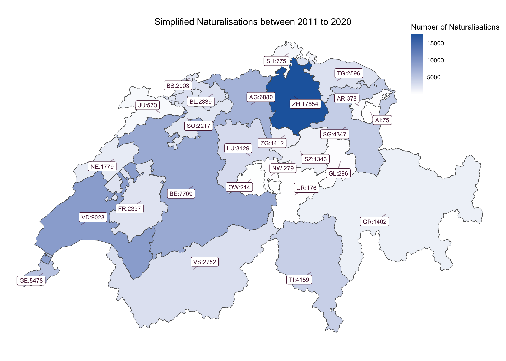
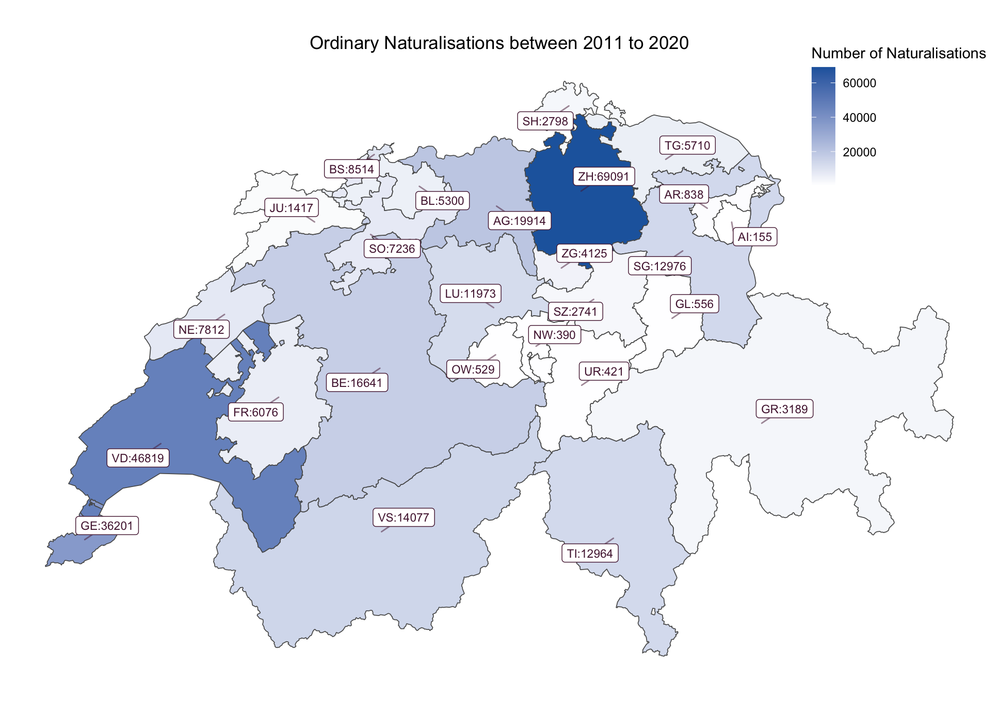
```
</center>

We see that in both Zurich is the one with higher counts. With 17.89% of total population of Switzerland at the beginning of 2020 it is likely to see such value.
Next come Vaud and Geneva, for the latter it is known that the city of Geneva is an international place, thus there is a higher foreigner part of the population than in other Canton.
Taking into account that Vaud is the only Swiss Canton bordering Geneva, internationality of Geneva impacts it directly.

Note that the lowest counts appear in most of central Switzerland where population is lower than previous Canton.
For example, Nidwald in which there is 14.78% (beginning of 2020) of foreigner citizen against 39.96% in Geneva.

Let's take a look at these maps with relative numbers.

<center>
```{r echo=FALSE, fig.show="hold", out.width='50%'}
par(mar = c(4, 4, .1, .1))
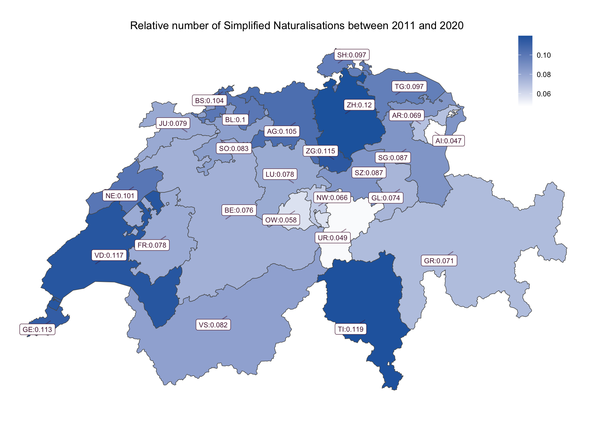
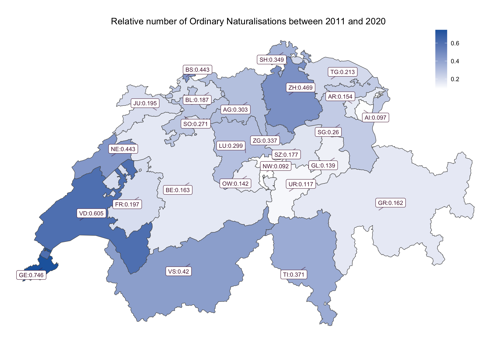
```
</center>

For simplified naturalization, we see that it is more fairly distributed.
For some Canton, darker ones, there is a higher proportion of naturalization than in the others.
For example, Ticino was lighter in the previous map and it is now one with the higher relative value which means that there is a higher proportion of the population that has acquired Swiss citizenship.

```{r echo=FALSE, out.width='60%', fig.align='center', include=FALSE}

```

```{r echo=FALSE, out.width='60%', fig.align='center', include=FALSE}

```

```{r echo=FALSE, out.width='60%', fig.align='center', include=FALSE}

```

```{r echo=FALSE, out.width='60%', fig.align='center', include=FALSE}

```

## Over time

As said for the general time series in the introduction, there has been a new law voted in 2014 and introduced in 2018.
We can see the consequence of this law on simplified and ordinary naturalization in the following time series.

```{r echo=FALSE, out.width='50%', fig.align='center'}
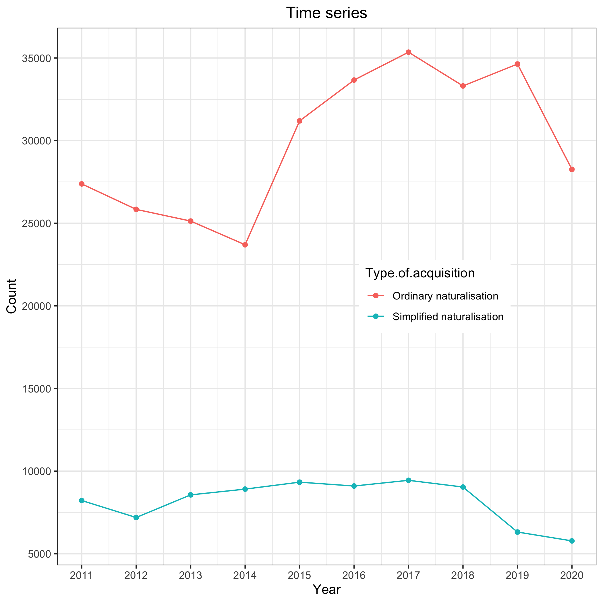
```

There is an increasing in the count for ordinary naturalization between 2015 and and 2017 which could be due to this voting because foreigner knew that it would be more difficult to acquire Swiss citizenship once the law comes into force.
Moreover, the drop in these counts begin only in 2020, this could be related to the administrative time needed to obtain citizenship.
Instead, for simplified naturalization, we see that this drop appears into 2019, maybe for the same reason that for ordinary naturalization, but taking into account that procedural time is shorter.

# Conclusion